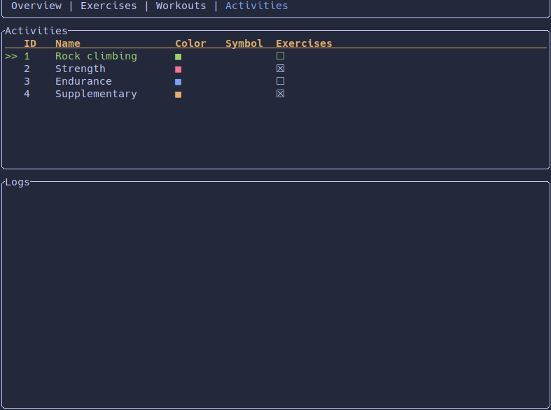

# RustyGains

I want to build something in Rust and gain experience with TUI applications.
Additionally, I need a simple tool to log my strength training, rock climbing,
and other activities. Therefore, this project is my attempt to combine all of
these elements.

This project is in an unusable state right now! Hopefully this will change in
the near future.

# ToDo:
## Features:
- Edit Mode for the activity log
- Delete activity log entry
- In activity_log view, it should automatically fill the exercises with the
  values from the last time this activity was done. Maybe shortcut to cycle
  trough the past and preselect the exercises?
- Edit exercise
- Edit activity
- Workouts
- Refactor overview.rs
- Highlight the marked activity in the heatmap
- Only take the activity with the highest intensity at the heatmap
  -> Increase intensity if done multiple activities at the day?
- Better error handling. Should make a clean exit with an error message.

## Bugs:
- Add activity: Index out of range when going too far up
- Dates are a mess. Always use naive date and functions for storing and 
  retrieving dates for better consistency
